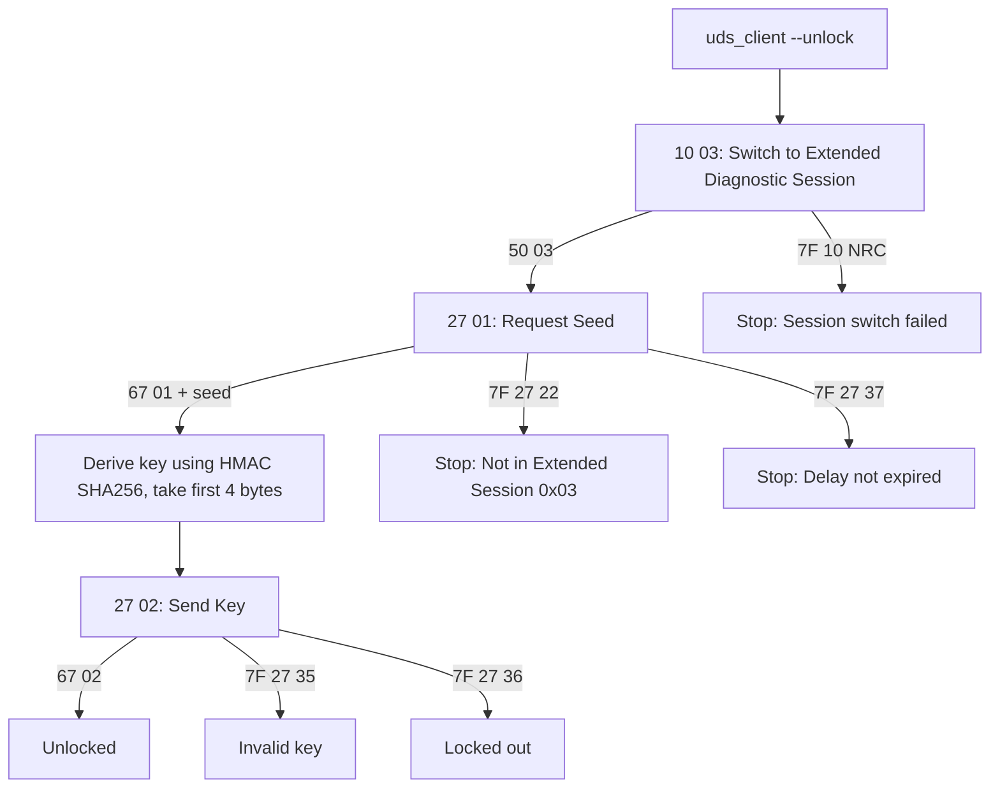

# UDS Security Access (0x27) — Educational Demo

Local ECU simulator + UDS client demonstrating the UDS SecurityAccess (0x27) seed/key flow.

**Transport:** UDP (educational simplification)

> Disclaimer: Educational simulation only. Not intended for real vehicle exploitation or unauthorised access.

---

## Requirements

- Python 3.10+
- Dependencies:
  ```bash
  pip install -r requirements.txt
  ```

---

## What this project demonstrates

 **UDS 0x10 DiagnosticSessionControl**
  - Switch to **Extended Diagnostic Session (0x03)**
 
 **UDS 0x27 SecurityAccess (Level 1 + Level 2)**
 - **Level 1**
  - Seed request: `27 01`
  - Key send: `27 02 <key>`
  - Demo key derivation: `HMAC-SHA256(seed, secret)[:4]`
 - **Level 2**
  - Seed request: `27 03`
  - Key send: `27 04 <key>`
  - Demo key derivation: `HMAC-SHA256(seed, secret)[:8]`
    
 **Basic ECU protection behaviours**
  - SecurityAccess blocked unless session is `0x03` → **NRC 0x22**
  - Invalid key → **NRC 0x35**
  - Exceeded attempts → **NRC 0x36**
  - Delay after lockout → **NRC 0x37**
  - Wrong sequence /wrong level (seed/key mismatch) → **NRC 0x24**

 **Testing + CI**
  - Unit tests for crypto functions
  - Behaviour tests for ECU state machine
  - GitHub Actions runs tests on 3.10/3.11/3.12

---

## Protocol overview 

### Session switch (required before SecurityAccess)
Switch to extended session  
`10 03` → `50 03`

### Level 1 unlock sequence
1) Request seed  
`27 01` → `67 01 <seed4>`

2) Derive key (demo algorithm)  
`key = HMAC-SHA256(seed4, secret)[:4]`

3) Send key  
`27 02 <key4>` → `67 02`

### Level 2 unlock sequence
1) Request seed  
`27 03` → `67 03 <seed8>`

2) Derive key (demo algorithm)  
`key = HMAC-SHA256(seed8, secret)[:8]`

3) Send key  
`27 04 <key8>` → `67 04`
---

## Flowchart (Level 1)


**Legend:** `7F` = negative response, `67` = positive response for service `27` (`0x27 + 0x40`)

---

## Quickstart (two terminals)

Default target: `udp://127.0.0.1:13400`

### Terminal 1 — Start ECU simulator

From `uds-security-access-tool/`:

```bash
python -m src.ecu_simulator
```

### Terminal 2 — Unlock Level 1

```bash
python -m src.uds_client --unlock --secret SecretKey
```
### Terminal 2 — Unlock Level 2

```bash
python -m src.uds_client --unlock --level 2 --secret SecretKey
```

---

## Commands
Show help:

```bash
python -m src.uds_client -h
```

Switch to Extended Session (0x03):

```bash
python -m src.uds_client --session 0x03
```

Request seed only (works only in session 0x03):

```bash
# Level 1 seed (27 01)
python -m src.uds_client --seed --level 1

# Level 2 seed (27 03)
python -m src.uds_client --seed --level 2
```
---

## Testing commands

### 1) Session switching tests (positive + negative)

```bash
# Valid: switch to extended session
python -m src.uds_client --session 0x03

# Valid: switch to default session
python -m src.uds_client --session 0x01

# Invalid session (should return NRC 0x12 Sub-function Not Supported)
python -m src.uds_client --session 0x99
```

### 2) SecurityAccess blocked in default session (expected NRC 0x22)

```bash
# Without switching to session 0x03 first
python -m src.uds_client --seed --level 1
```

### 3) Seed request (expected positive response 0x67)

```bash
python -m src.uds_client --session 0x03

# Level 1
python -m src.uds_client --seed --level 1

# Level 2
python -m src.uds_client --seed --level 2
```

### 4) Unlock success

```bash
# Level 1
python -m src.uds_client --unlock --level 1 --secret SecretKey

# Level 2
python -m src.uds_client --unlock --level 2 --secret SecretKey
```

### 5) Unlock failure + lockout demonstration (NRC 0x35 → 0x36 → 0x37)

```bash
python -m src.uds_client --unlock --level 1 --secret WRONG
python -m src.uds_client --unlock --level 1 --secret WRONG
python -m src.uds_client --unlock --level 1 --secret WRONG

# Now try seed during lockout window
python -m src.uds_client --seed --level 1
```

### 6) After lockout expires (shows recovery)

```bash
# Wait ~10 seconds (LOCKOUT_DURATION_S), then:
python -m src.uds_client --seed --level 1
```

### 7) Wrong level / sequence demo (expected NRC 0x24)

```bash
# Ask for level 1 seed...
python -m src.uds_client --seed --level 1

# ...then try to unlock level 2 (seed/key mismatch may trigger NRC 0x24 in the simulator)
python -m src.uds_client --unlock --level 2 --secret SecretKey
```

### Optional: raw UDP packet test (byte-level)

```bash
python -c "import socket; s=socket.socket(socket.AF_INET,socket.SOCK_DGRAM); s.settimeout(1); s.sendto(bytes([0x10,0x03]),('127.0.0.1',13400)); print(s.recvfrom(4096)[0].hex())"
```

---

## Example output (Level 2)

```text
python -m src.uds_client --unlock --level 2 --secret SecretKey
Session Response: UDSResponse(ok=True, sid=0x50, payload=03)
Seed Response: UDSResponse(ok=True, sid=0x67, payload=03<seed...>)
Key Response: UDSResponse(ok=True, sid=0x67, payload=04)
Security Level 2 unlocked successfully.
```

---
## Demo: lockout behaviour (expected responses)
Expected:
- Invalid key → `7F 27 35`
- Exceeded attempts → `7F 27 36`
- Delay not expired → `7F 27 37`

---

## NRC reference (used in this demo)

| NRC  | Meaning                         |
|------|---------------------------------|
| 0x22 | Conditions Not Correct          |
| 0x35 | Invalid Key                     |
| 0x36 | Exceeded Number Of Attempts     |
| 0x37 | Required Time Delay Not Expired |

---

## Tests

Run:

```bash
python -m pytest -q
```

---

## Project structure

```text
uds-security-access-tool/
  src/
    ecu_simulator.py      # ECU logic + UDP server
    uds_client.py         # Client CLI (session / seed / unlock)
    security_access.py    # seed, key derivation, constant-time compare
  tests/
    test_security_access.py
    test_ecu_security_access.py
  requirements.txt
```

---

## Notes

- Uses UDP instead of ISO-TP/CAN to keep the demo lightweight and easy to run locally.
- Security algorithm is intentionally simple for learning; real ECUs often use proprietary schemes and extra protections.
